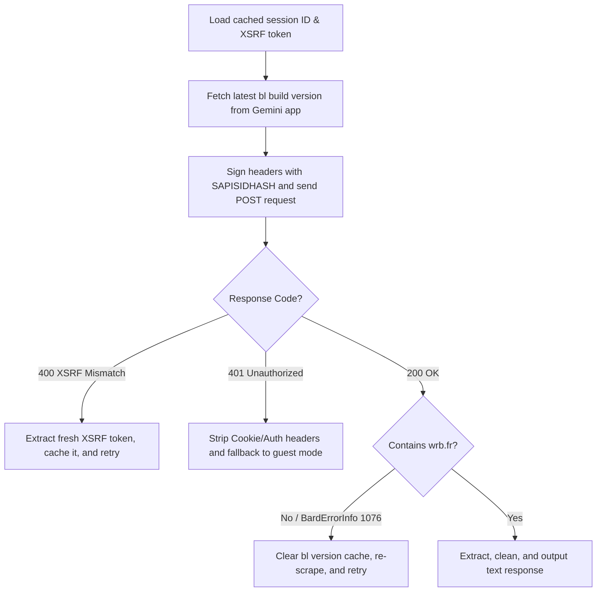

# Google Gemini Web Protocol Reverse Engineering Guide

This document explains the communication protocol used by the Google Gemini web application and how the standalone client in `test.py` / `gmn_api.py` communicates directly with Google's backend.

---

## 1. How the StreamGenerate Protocol Works

The Gemini web application interacts with the Google backend using a specific HTTP RPC endpoint:

### A. The Endpoint
* **URL**: `https://gemini.google.com/_/BardChatUi/data/assistant.lamda.BardFrontendService/StreamGenerate`
* **Query Parameters**:
  - `bl`: The backend version identifier string (e.g., `boq_assistant-bard-web-server_20260609.21_p0`). If this build parameter is outdated or missing, the server rejects requests with HTTP 400 or error code `1076`.
  - `hl`: The UI language code (`en` for English).
  - `_reqid`: An integer request ID sequence (calculated using epoch time: `int(time.time()) % 1000000`).
  - `rt`: `c` which triggers chunked, streaming responses.

### B. Headers
The request must include specific browser headers to pass CSRF validation and security constraints:
- `Content-Type`: `application/x-www-form-urlencoded`
- `Origin`: `https://gemini.google.com`
- `Referer`: `https://gemini.google.com/app`
- `X-Same-Domain`: `1`
- `User-Agent`: A modern browser user agent (e.g., Chrome/Firefox). **CRITICAL:** The User-Agent used in the API request must exactly match the one used to log into the browser session, or Google's security systems will flag the request with a `1076` block.

---

## 2. Advanced Security & Authentication Bypass

When making requests authenticated by browser cookies, Google's backend applies a series of anti-abuse checks. Our implementation uses several mechanisms to resolve and bypass these checks:

### A. Cryptographic Request Signing (`SAPISIDHASH`)
To prevent session-hijacking, Google's backend requires all cookie-authenticated requests to carry a cryptographic signature. Simply sending the cookies is insufficient and results in `401 Unauthorized` or `1076` blocks.

* **Trigger**: Whenever the `SAPISID` cookie is present in the request cookies.
* **Mechanism**:
  1. Extract the `SAPISID` cookie value from the browser session.
  2. Get the current Unix timestamp in seconds (`ts`).
  3. Compute the SHA-1 hash of the string combining the timestamp, the SAPISID cookie value, and the origin URL:
     $$\text{hash} = \text{SHA-1}( \text{timestamp} + " " + \text{SAPISID} + " https://gemini.google.com" )$$
  4. Construct the signature and append it as the `Authorization` header:
     ```http
     Authorization: SAPISIDHASH <timestamp>_<hash_hex>
     ```

### B. Session and XSRF Caching (`session_cache.json`)
Google's API expects the XSRF token (passed in the `"at"` parameter in the POST body) to be bound to a persistent Session ID.
* If a new Session ID (represented by the UUID in `inner[59]`) is generated on every request, the previous XSRF token is immediately invalidated, triggering a `400 CSRF Mismatch` on every execution.
* **Solution**: We cache both the `session_id` and the `xsrf_token` together in `session_cache.json`. By reusing the same session ID across runs, the XSRF token remains valid, preventing mismatch checks on subsequent requests.

### C. JA3 TLS Fingerprint Impersonation (`curl-cffi`)
Standard Python client libraries (like `requests` or `urllib3`) send standard OpenSSL TLS handshakes that have distinct JA3 signatures easily blocked by Google's anti-bot firewall under load.
* **Solution**: We integrate `curl-cffi` compatibility. If `curl-cffi` is installed, it impersonates a real Chrome browser's TLS fingerprint (`impersonate="chrome"`), which natively bypasses bot-detection layers, eliminating `1076` or `1099` rate-limit errors.

---

## 3. Request Payload Structure (`f.req`)

The payload is passed in the request body under the key `f.req`. It is structured as a twice-serialized JSON array:

1. **Outer Array**: `[null, "inner_json_string"]`
2. **Inner Array**: A JSON list containing 102 items (`[None] * 102`):
   - `[0]`: Contains the user prompt `[prompt, 0, null, null, null, null, 0]`.
   - `[1]`: Language config `["en"]`.
   - `[17]`: Thinking depth `[[0]]` (Deepest/Thinking on) vs `[[4]]` (Shallowest/Off).
   - `[59]`: Session identification UUID string (must be kept constant for XSRF reuse).
   - `[79]`: Model Category ID:
     * `1` = `gemini-3.5-flash` (Default)
     * `2` = `gemini-3.5-flash-thinking`
     * `3` = `gemini-3.1-pro` (Requires cookie authentication)
     * `4` = `gemini-auto`
     * `5` = `gemini-3.5-flash-thinking-lite`
     * `6` = `gemini-flash-lite`

---

## 4. Extracting and Parsing the Response

The server sends responses back in chunked text streams.
1. The script filters the response body line-by-line looking for envelopes containing `"wrb.fr"`.
2. Each matching line represents a serialized JSON structure:
   ```text
   [["w", "wrb.fr", "inner_envelope_string"]]
   ```
3. `inner_envelope_string` is parsed as JSON. Index `[4]` contains the generated assistant parts.
4. The script collects text segments recursively and filters out internal metadata, returning the longest accumulated reply.

---

## 5. Script Workflows and Directory Structure

### A. Directory Files
* [get_cookies.py](get_cookies.py): Interactive cookie extractor. Opens Chrome in visible mode using your local profile `./ai_profile`, navigates to Gemini, validates your login session by looking for `__Secure-1PSID`, filters out garbage cookies, and saves the 9 core Google auth cookies to `cookies.txt`.
* [test.py](test.py) / [gmn_api.py](gmn_api.py): Client API wrapper. Loads your cookies, resolves paths relative to the script directory, signs requests, maintains the session cache, and decodes response streams.

### B. Client Execution Protocol
When `test.py` is executed, it runs through the following self-healing state machine:



### Running the Project
1. Run this to authenticate and export cookies:
   ```bash
   python get_cookies.py
   ```
2. Run this to execute queries:
   ```bash
   python gmn_api.py
   ```
