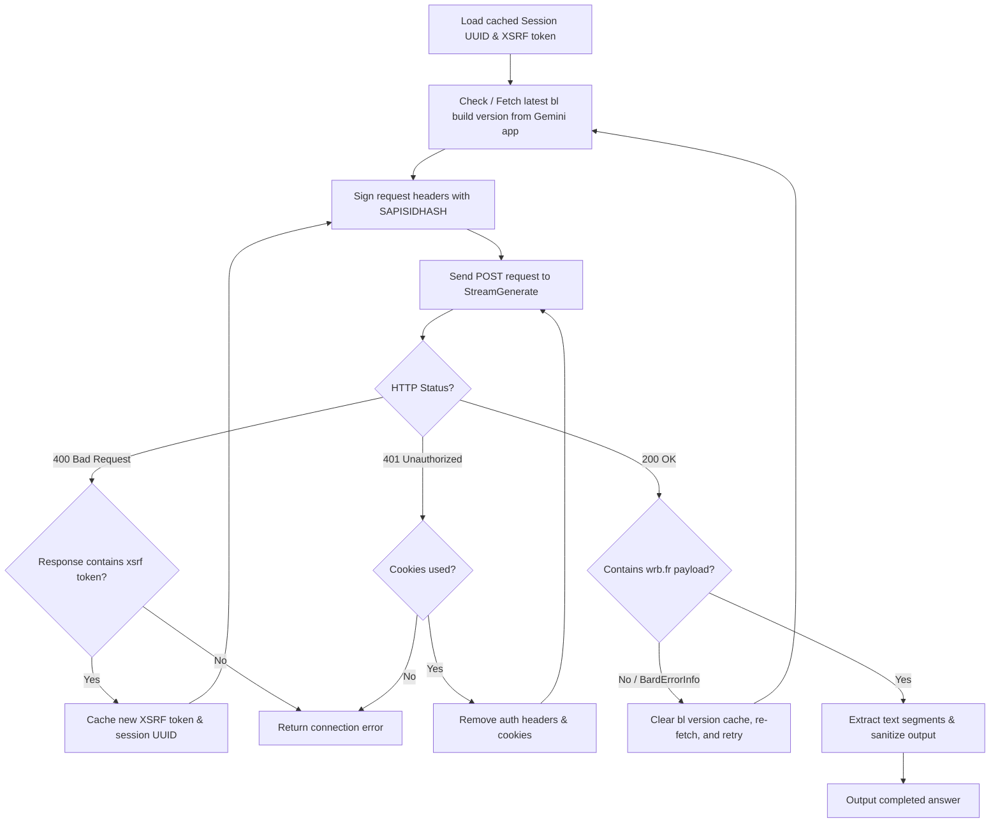

# Google Gemini Web Protocol Reverse Engineering Guide (2026 Edition)

This guide documents the internal communication protocol, authentication mechanisms, payload structures, and self-healing request state machine utilized by the Google Gemini Web Application (`gemini.google.com`). It serves as reference material for the direct client wrapper implementations in this workspace: [gmn_api.py](file:///D:/LT/PL_AI/gmn_api.py) and [gmn_api_small.py](file:///D:/LT/PL_AI/gmn_api_small.py).

---

## 1. StreamGenerate Protocol Specification

Gemini uses a customized HTTP RPC protocol built on chunked streaming transfers. The client submits a prompt payload and receives a real-time, token-by-token text stream response.

### A. Endpoint Resolution
* **Chat Generation URL**: 
  `https://gemini.google.com/_/BardChatUi/data/assistant.lamda.BardFrontendService/StreamGenerate`
* **Alternate Batch Execute URL**:
  `https://gemini.google.com/_/BardChatUi/data/batchexecute?rpcids=L5adhe` (used for secondary app configurations and tool execution).

### B. Query Parameters
When hitting the `StreamGenerate` endpoint, the following query parameters must be provided:

| Parameter | Type | Description |
| :--- | :--- | :--- |
| `bl` | String | **Build Version**: The active backend identifier (e.g., `boq_assistant-bard-web-server_20260609.21_p0`). If this is outdated, the server rejects requests with error code `1076` or `1099`. |
| `hl` | String | **Localization Language**: Language code for the user session (typically `en` or `vi`). |
| `_reqid` | Integer | **Request Sequence ID**: Calculated dynamically to prevent replay detection. Usually generated as `int(time.time()) % 1000000`. |
| `rt` | String | **Response Type**: Set to `c` to trigger HTTP chunked encoding / server-sent stream response. |

### C. Critical Headers
Google's gateway validates incoming requests against strict browser fingerprint rules:

```http
Content-Type: application/x-www-form-urlencoded
Origin: https://gemini.google.com
Referer: https://gemini.google.com/app
X-Same-Domain: 1
User-Agent: Mozilla/5.0 (Windows NT 10.0; Win64; x64) AppleWebKit/537.36 (KHTML, like Gecko) Chrome/124.0.0.0 Safari/537.36
```

> [!IMPORTANT]
> **User-Agent Lockdown**: The `User-Agent` header sent with API requests *must* exactly match the browser agent that performed the initial login. Even minor discrepancies in browser versions or OS tokens will trigger a security challenge and result in an immediate `1076` error block.

---

## 2. Advanced Security & Session Management

Google applies several anti-abuse layers to session-authenticated requests. Bypassing these requires precise emulation of the browser's cryptographic state.

### A. Cryptographic Request Signing (`SAPISIDHASH`)
Any request accompanied by cookie authentication must carry a dynamic signature. Static headers are immediately rejected with `401 Unauthorized`.

* **Triggers**: When the `SAPISID` cookie is present.
* **Mechanism**:
  1. Extract the `SAPISID` cookie value from the active cookies.
  2. Generate a Unix epoch timestamp in seconds (`ts`).
  3. Format the signature payload string as: `ts + " " + SAPISID + " https://gemini.google.com"`
  4. Compute the SHA-1 hash of the payload string.
  5. The authorization header is formatted as:
     `Authorization: SAPISIDHASH <ts>_<sha1_hex>`

#### Python Signature Reference:
```python
import time
import hashlib

def make_sapisidhash(sapisid: str) -> str:
    ts = int(time.time())
    h = hashlib.sha1(f"{ts} {sapisid} https://gemini.google.com".encode()).hexdigest()
    return f"SAPISIDHASH {ts}_{h}"
```

### B. CSRF Protection and Session Binding
Google validates the Cross-Site Request Forgery (CSRF) token (passed via the `"at"` parameter in the POST body) against the persistent session identifier.

1. **Session Pinning**: The session is represented by a unique UUID string passed in index `[59]` of the inner payload. Generating a fresh UUID on every request forces Google's backend to invalidate the associated CSRF/XSRF token, resulting in continuous `400 CSRF Mismatch` errors.
2. **Session Cache**: We persist the UUID and the associated XSRF token in `session_cache.json` to preserve state consistency.
3. **XSRF Recovery**: If the server returns a `400 Bad Request` containing an XSRF mismatch, it transmits the updated token within the response string in the format: `["xsrf","<token>"]`. The client must extract this token, write it to `session_cache.json`, and replay the query.

### C. JA3 TLS Fingerprint Impersonation
Standard network clients (like Python's `urllib3` or `requests`) reveal unique TLS fingerprints that distinguish them from real browsers. Under higher volumes, Google's firewall intercepts these non-browser handshakes and returns `1076` / `1099` rate-limit errors.

* **Solution**: The API attempts to use `curl-cffi` if available. `curl-cffi` performs low-level socket handshakes configured to mimic a Chrome TLS signature (`impersonate="chrome"`), bypassing Cloudflare/Google fingerprinting blocks completely.

---

## 3. Cookie Harvesting & Settlement

To authenticate the client wrapper, a list of core cookies must be scraped from a legitimate browser session.

### A. Essential Authentication Cookies
The client filters and extracts only the 9 core cookies needed to maintain a valid Google session:

| Cookie Name | Purpose |
| :--- | :--- |
| `__Secure-1PSID` | **Primary Session ID**: Essential session state identifier. |
| `__Secure-1PSIDTS` | **Timestamp Token**: Rotated frequently by Google to enforce session liveness. |
| `__Secure-3PSID` | **Third-party Session ID**: Secondary cookie tracking cross-origin state. |
| `__Secure-3PSIDTS` | **Third-party Timestamp**: Rotated alongside primary timestamp. |
| `SID`, `HSID`, `SSID` | **Legacy Core Identifiers**: Basic authentication and verification cookies. |
| `APISID`, `SAPISID` | **API Credentials**: Crucial for signature computation (`SAPISIDHASH`). |

### B. Interactive Flow
Harvesting is handled via [get_cookies.py](file:///D:/LT/PL_AI/get_cookies.py).
1. It initializes Chromium with Playwright using a persistent profile directory `./ai_profile`.
2. It launches a non-headless browser window and navigates to the Gemini application page.
3. Because Playwright blocks automated browser attributes via `--disable-blink-features=AutomationControlled`, the session behaves identically to a user's standard browser.
4. **Settlement Mechanism**: The script prints a message to the console and waits for the user to press **Enter**. This ensures the page is fully rendered, redirects are complete, and the security tokens are fully settled.
5. Once **Enter** is pressed, it extracts all current cookies from the browser context, filters them against the core cookie table, writes them to `cookies.txt` as a single `Cookie` header string, and closes the browser context.

---

## 4. Request Payload Structure (`f.req`)

The request body contains the raw query parameters inside `f.req`. It is structured as a twice-serialized JSON string.

```json
{"f.req": "[null, \"[prompt, ...] (Inner JSON Array)\"]"}
```

The inner JSON array is a flat array containing 102 indices. Below is the mapping of relevant keys configured by the client wrapper:

| Inner Index | DataType | Purpose | Configuration Value |
| :--- | :--- | :--- | :--- |
| `[0]` | List | **Prompt Array** | `[prompt, 0, null, null, null, null, 0]` |
| `[1]` | List | **Language Config** | `["en"]` |
| `[2]` | List | **Context Array** | `["", "", "", null, null, null, null, null, null, ""]` |
| `[6]` | List | **Unknown** | `[0]` |
| `[7]` | Integer | **Unknown** | `1` |
| `[10]` | Integer | **Unknown** | `1` |
| `[11]` | Integer | **Unknown** | `0` |
| `[17]` | List | **Thinking Control** | `[[think_level]]` (typically `[[4]]` to disable thinking, or `[[0]]` for full model thinking) |
| `[18]` | Integer | **Unknown** | `0` |
| `[27]` | Integer | **Unknown** | `1` |
| `[30]` | List | **Unknown** | `[4]` |
| `[41]` | List | **Unknown** | `[2]` |
| `[53]` | Integer | **Unknown** | `0` |
| `[59]` | String | **Session UUID** | Persistent UUID (keeps XSRF token valid) |
| `[61]` | List | **Unknown** | `[]` |
| `[68]` | Integer | **Unknown** | `1` |
| `[79]` | Integer | **Model ID** | Mapped to category ID selection |

### Model Mappings (`inner[79]`)
The model IDs correspond to specific model targets in the Gemini web application:
* `1` = `gemini-3.5-flash`
* `2` = `gemini-3.5-flash-thinking`
* `3` = `gemini-3.1-pro` (requires authenticated cookie state)
* `4` = `gemini-auto`
* `5` = `gemini-3.5-flash-thinking-lite`
* `6` = `gemini-flash-lite`

---

## 5. Chunk Parsing & Sanitization

Because the connection operates over HTTP chunked streaming, responses are returned as successive lines containing protocol metadata.

### A. SSE/Chunk Format
The response body is evaluated line-by-line. The client skips lines that are empty or do not contain the target payload envelope:
```text
82
[["w", "wrb.fr", "[\"wrb.fr\", ... (Decoded Inner Envelope)\"]"]]
```

### B. Decoding Inner Envelope
1. Locate the beginning of the JSON array (the first `[` character).
2. Deserialize the array. The third item (index `2`) represents the inner JSON-encoded string.
3. Deserialize this inner string into a list.
4. Iterate over index `inner[4]`, which contains the response segments.
5. Extract each text segment, accumulating them into a final response. The client retains the longest accumulated response string to ensure the final output is captured completely.

### C. Sanitization Regex
Google embeds code execution metadata and temporary image links inside the return stream. These are stripped before returning the text:
* **Code execution metadata**:
  ```regex
  ```(?:python|javascript|text)\?code_(?:reference|stdout)&code_event_index=\d+\n.*?```\n?
  ```
* **Temporary assets**:
  ```regex
  http://googleusercontent\.com/card_content/\d+\n?
  ```

---

## 6. Client Self-Healing State Machine

[gmn_api.py](file:///D:/LT/PL_AI/gmn_api.py) implements a self-healing flow chart to automatically bypass version drifts, expired sessions, and XSRF challenges:


